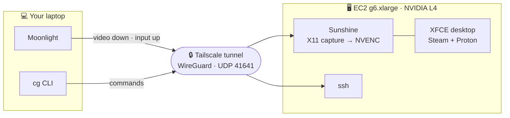
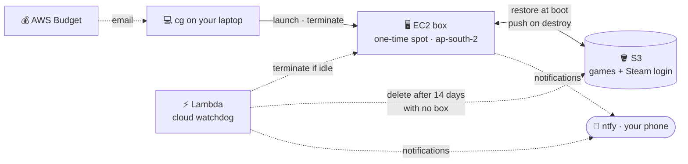
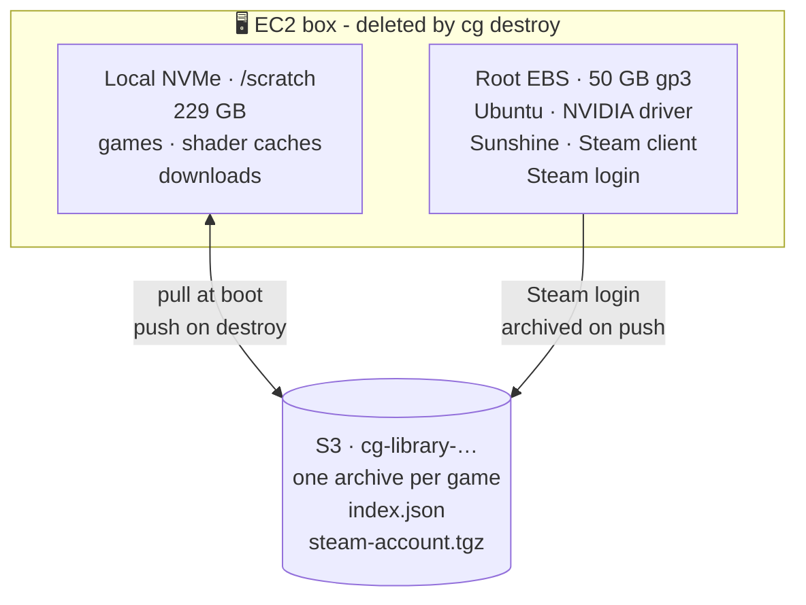
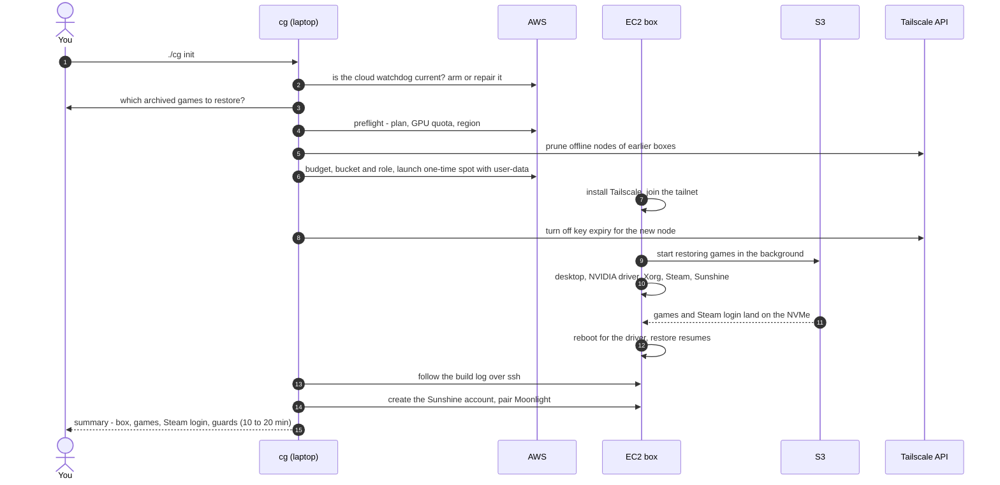
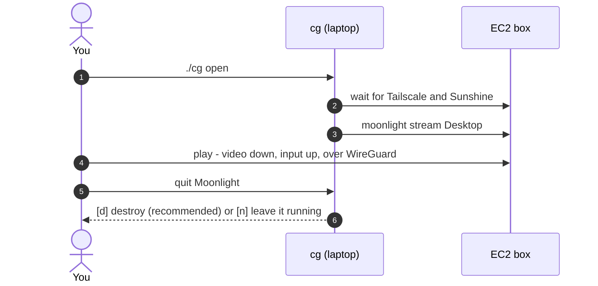
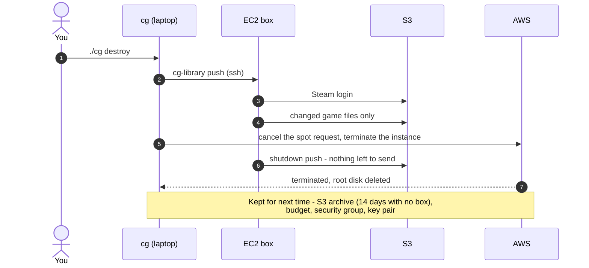
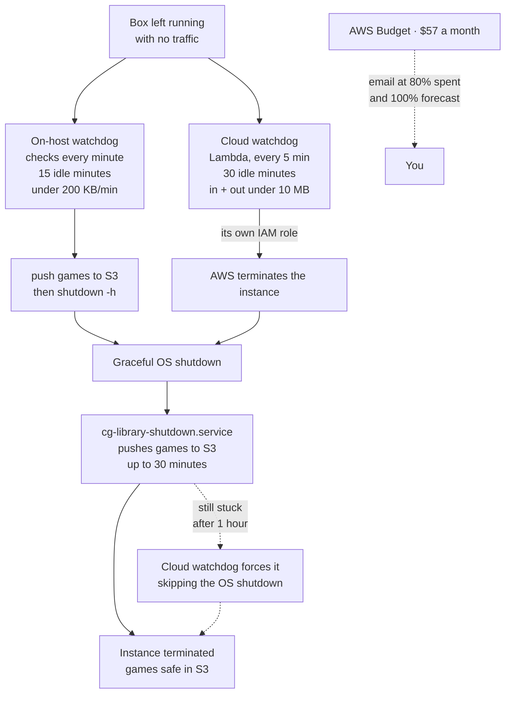
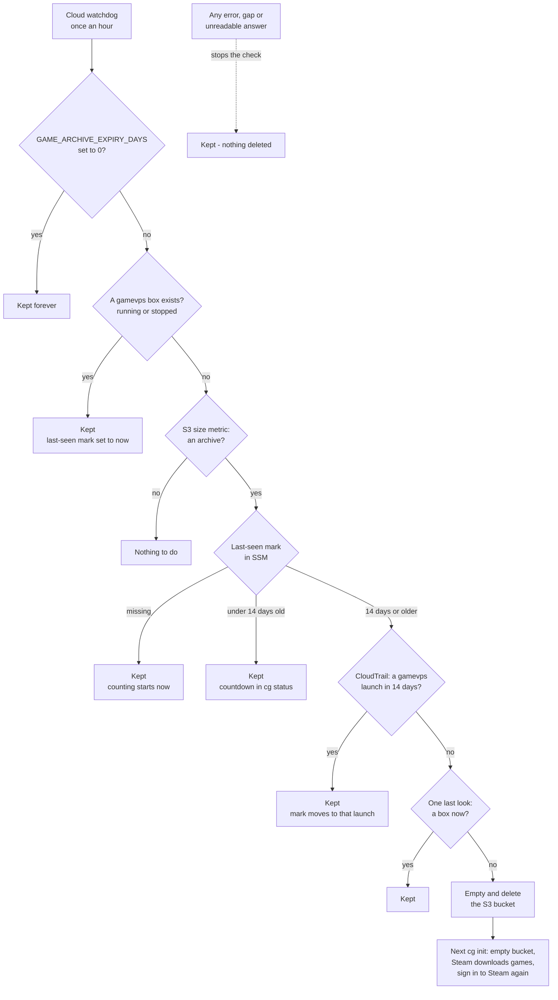
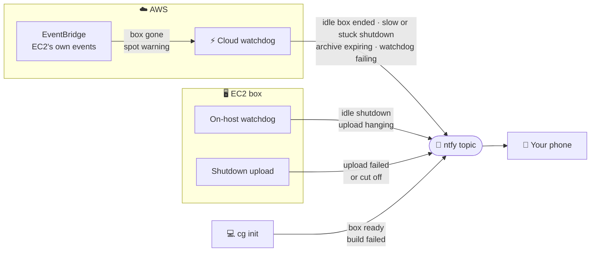

# Architecture

A Linux desktop with a GPU, built on AWS when you want to play and destroyed when you stop. You
reach it only through a private Tailscale network, stream it with Moonlight, and keep your games
in S3 between sessions.

## The big picture

**How you connect.** Everything goes through one encrypted Tailscale tunnel; the box has no other
way in.

**What runs where.** The box is disposable; S3 keeps your games, and a cloud watchdog
terminates a box nobody is using.

The other guard, a watchdog on the box itself, is in [Flow 4](#flow-4---you-forget-the-box).
Nothing on the box is reachable from the internet: the security group allows one inbound port,
UDP 41641, and that is Tailscale's.

## The stack

| Layer | Uses | Runs on | Why this |
|---|---|---|---|
| Control | `cg` (bash) and `lib/`, tested offline in `tests/` | laptop | one command per job; risky paths proven with stubs |
| Compute | EC2 `g6.xlarge` - 4 vCPU, NVIDIA L4 | AWS `ap-south-2` | the only GPU type there that fits a 4 vCPU quota |
| Purchase | one-time spot, terminated on shutdown | AWS | ~INR 20/hour against ~INR 85 on demand |
| Build | Ubuntu 24.04, configured by user-data in 16 stages (`lib/bootstrap.d/`) | box | a clean box every session, no image to maintain |
| Network | Tailscale (WireGuard); one security-group rule | laptop + box | no public ports, no Elastic IP |
| GPU | NVIDIA driver 610 (open), DRM KMS off | box | KMS on blocks screen capture |
| Display | headless Xorg at a fixed 1920x1080, LightDM autologin, XFCE | box | the L4 has no monitor outputs |
| Streaming | Sunshine: X11 capture, NVENC encode, `packet_size 1024` | box | Tailscale's MTU is 1280 |
| Client | Moonlight | laptop, phone | hardware decode on the device |
| Audio | PipeWire with a virtual sink | box | there is no sound card to play into |
| Games | Steam (Valve's `.deb`) and Proton | box | Windows games on Linux |
| Game storage | local NVMe at `/scratch`, archived per game to S3 with `s5cmd` | box + S3 | fast and free locally, durable in S3 |
| S3 access | EC2 instance role | box | no access key on the box to leak |
| Guards | on-host watchdog, cloud watchdog (Lambda + EventBridge), AWS Budget | box, AWS | two independent ways to stop a forgotten box, and an email |
| Notifications | ntfy (optional, `GAME_NTFY_URL`) | box, Lambda, laptop | push to a phone with no account and nothing to confirm |
| Spend | Cost Explorer (for `cg cost`) | AWS | the only billed API here, $0.01 a call |

## Where things live

| | Lives on | Survives `cg destroy`? |
|---|---|---|
| OS, driver, Sunshine, Steam client | root EBS | no - rebuilt by the next `cg init` |
| Your games, their saves and shader caches | NVMe, archived to S3 | **yes**, in S3 - deleted after 14 days with no box ([why](cost-guards.md#game-archive-expiry)) |
| Steam login | root EBS, archived to S3 | **yes**, in S3 |
| Proton and the Steam runtime | NVMe | no - Steam re-downloads them in under a minute |
| Security group, key pair, budget | AWS | **yes** - free, reused |

The root disk size is `GAME_DISK_GB`: 100 GB by default, set to 50 here in `.env`. The NVMe is
wiped whenever the instance stops, which is why S3 holds the durable copy. Details:
[game-library.md](game-library.md).

## Flow 1 - `cg init`: build a box

The game restore runs **alongside** the build, so a 160 GB game is usually on disk by the time
the desktop is. The box is only reported ready once the restore has finished.

## Flow 2 - `cg open`: play

On a spot box there is no stop, only destroy - a stopped one-time spot instance can never start
again. With `GAME_SPOT=0` the box is on demand, and `cg open` starts it if it is stopped.

## Flow 3 - `cg destroy`: save and delete

If the push fails, `cg destroy` stops and deletes nothing. What it removes and keeps:
[destroy.md](destroy.md).

## Flow 4 - you forget the box

Both guards end in the **same place**: a graceful OS shutdown, where
`cg-library-shutdown.service` pushes the games to S3 before the machine goes down. The on-host
watchdog also pushes before it calls `shutdown`, so its shutdown push finds nothing left to send;
the cloud watchdog runs outside the box and can only ask AWS to terminate it, which AWS turns into
that same graceful shutdown. Two pushes never run at once - a second one waits for the first.

The shutdown push is allowed 30 minutes (`TimeoutStopSec=1800`). When AWS itself terminates the
box it may cut the power sooner than that, and a spot interruption gives only two minutes, so
`cg destroy` - which pushes first and deletes nothing if that fails - stays the safe way out.

Each guard is independent, so one failing is caught by the other. Both wait 20 minutes after
boot before they arm, so a build is never mistaken for idleness. A box still going down an hour later -
whichever guard started it - is forced by the cloud watchdog. The budget stops nothing - it is the
backstop that tells you. Details: [cost-guards.md](cost-guards.md).

## Flow 5 - nobody plays for two weeks

With no box, the S3 archive is the only thing still billing, so it is deleted after 14 days
unused. That deletes the only copy of every game, so both records must agree first - the mark the
watchdog keeps fresh while a box exists, and CloudTrail's launch history - and anything uncertain
keeps it. Until it deletes, it makes no S3 request at all: its marks are free SSM parameters, and
whether there is an archive comes from S3's free daily size metric. `cg watchdog check` runs every
step as a dry run. Details, and what is lost:
[cost-guards.md](cost-guards.md#game-archive-expiry).

## Notifications - what reaches your phone

Off unless `GAME_NTFY_URL` is set. A notification is never load-bearing: one that cannot be sent
is logged and ignored, and it never changes what a guard decides. The box cannot report its own
end, so "box gone" comes from EC2's own events rather than from the box. None of it costs
anything - EC2's events, the extra invocations and the requests are all inside AWS's free
allowances. The full list: [cost-guards.md](cost-guards.md#notifications).

## Key decisions

- **Tailscale is the only way in.** Each machine gets a stable `100.x` address that survives the
  AWS public IP changing, so there is no Elastic IP to pay for. The single inbound rule, UDP 41641,
  is what lets Tailscale build a direct path: without it, traffic falls back to a relay at
  43-71 ms instead of 16 ms, and nothing errors - it just feels slow.
- **A monitor that does not exist.** The L4 has no display outputs, so `xorg.conf` starts X with
  `AllowEmptyInitialConfiguration` and a virtual `DFP-0` at a fixed 1920x1080. LightDM logs in
  automatically so there is a desktop to capture.
- **The resolution never changes.** Switching the X mode at runtime left capture broken for every
  later session, so the box stays at 1920x1080 and Moonlight scales. See
  [streaming.md](streaming.md).
- **X11 capture, GPU encode.** NvFBC is NVIDIA's fast capture path, but it failed after the first
  session on this box. X11 capture grabs frames on the CPU - about one core at 1080p60 - while
  encoding still runs on the L4's NVENC.
- **Sunshine tuned for the tunnel.** `packet_size = 1024` because Tailscale's MTU is 1280 and
  Sunshine's default of 1392 fragments into stutter; `csrf_allowed_origins` so its web UI accepts
  requests from the tailnet.
- **Games on local NVMe, kept in S3.** The instance store is the fastest disk on the box and free,
  and S3 pins no availability zone. It replaced an EBS volume costing INR 1,284 a month. See
  [game-library.md](game-library.md).
- **One-time spot that terminates.** With the games in S3 there is nothing on the box worth
  keeping, so every guard terminates rather than stops:

  | Purchase model | On shutdown | Why |
  |---|---|---|
  | on demand (`GAME_SPOT=0`) | `stop` | a misfiring watchdog parks the box and you restart it |
  | spot (default) | `terminate` | a stopped spot box can never start again, and its root disk would bill forever |

- **Roles, not keys.** The box reads and writes its bucket through an instance role, and the
  cloud watchdog runs on a Lambda role allowed only to describe, stop or terminate the
  `gamevps`-tagged instance. Nothing holds a long-lived AWS secret. See
  [cost-guards.md](cost-guards.md).

## Go deeper

| Want to know | Read |
|---|---|
| How to get an AWS account able to launch this | [aws-account-setup.md](aws-account-setup.md) |
| Every command | [commands.md](commands.md) |
| What each piece costs | [cost.md](cost.md) |
| How the games and Steam login persist | [game-library.md](game-library.md) |
| Why something is built the way it is | [troubleshooting.md](troubleshooting.md) |
